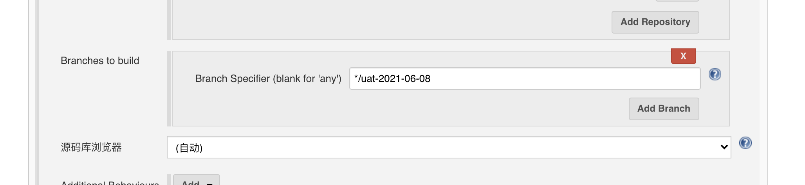
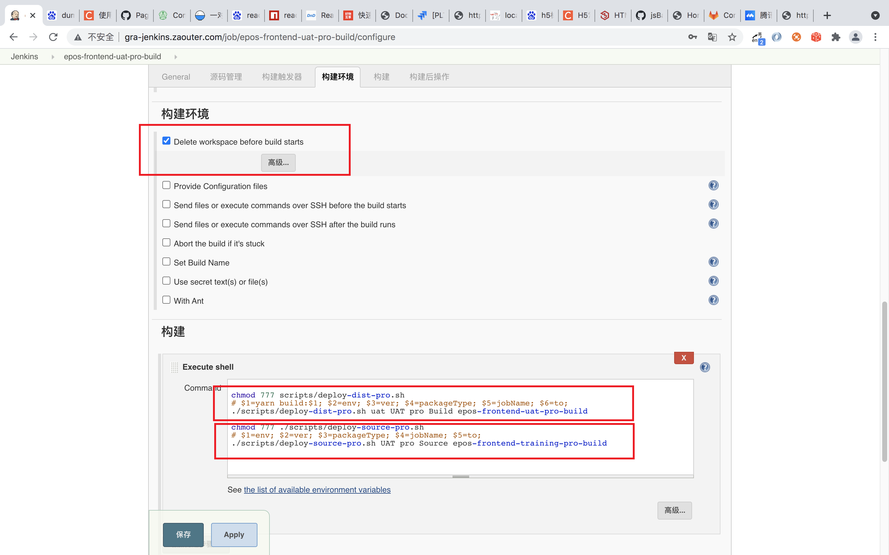
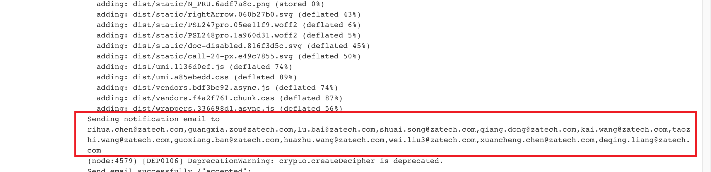
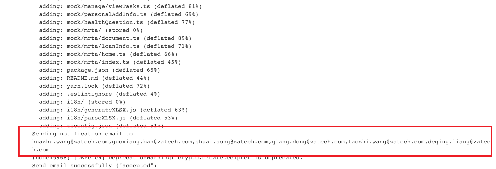

  <h3>jenkins 工作流程</h3>
  

     
     
    
  

  
dist脚本:

  

    chmod 777 scripts/deploy-dist-pro.sh 
    # $1=yarn build:$1; $2=env; $3=ver; $4=packageType; $5=jobName; $6=to; 
    ./scripts/deploy-dist-pro.sh uat UAT pro Build epos-frontend-uat-pro-build
  

  
source Code脚本:

  

    chmod 777 ./scripts/deploy-source-pro.sh 
    # $1=env; $2=ver; $3=packageType; $4=jobName; $5=to; 
    ./scripts/deploy-source-pro.sh UAT pro Source epos-frontend-training-pro-build
  

  

     
    
  

